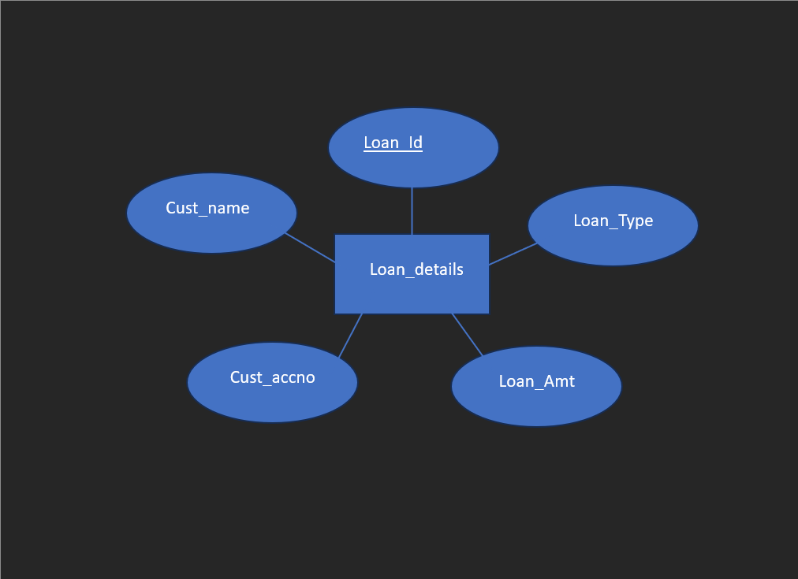
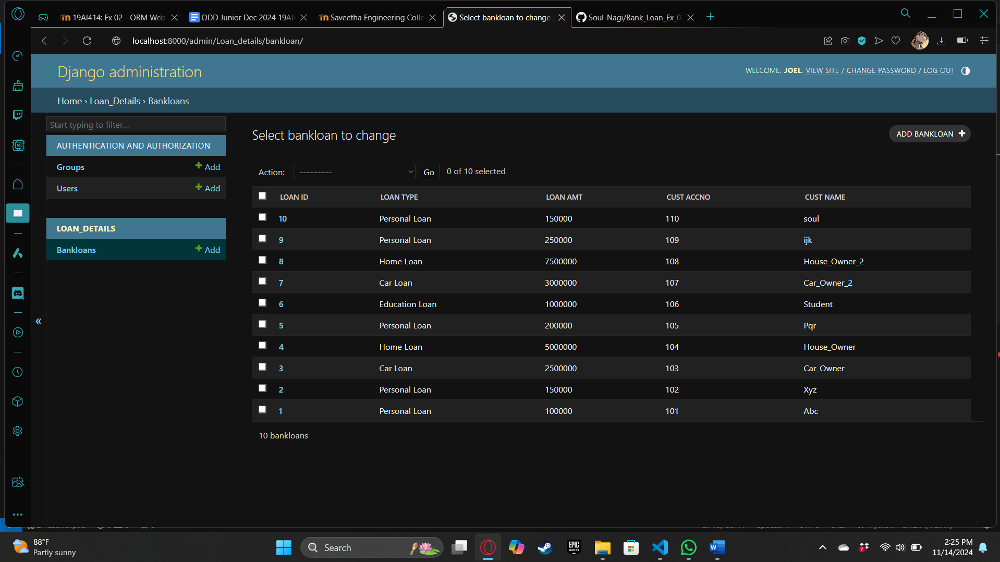

# Ex02 Django ORM Web Application
## Date: 
14/11/2024
## AIM
To develop a Django application to store and retrieve data from a bank loan database using Object Relational Mapping(ORM).

## ENTITY RELATIONSHIP DIAGRAM

## DESIGN STEPS

### STEP 1:
Clone the problem from GitHub

### STEP 2:
Create a new app in Django project

### STEP 3:
Enter the code for admin.py and models.py

### STEP 4:
Execute Django admin and create details for 10 books

## PROGRAM

"""
-model.py

from django.db import models

from django.contrib import admin

class bankloan(models.Model):
    Loan_ID=models.IntegerField(primary_key=True)
    Loan_Type=models.CharField(max_length=30)
    Loan_Amt=models.IntegerField()
    cust_accno=models.IntegerField()
    cust_name=models.CharField(max_length=30)

class bankloanAdmin(admin.ModelAdmin):
    list_display=('Loan_ID','Loan_Type','Loan_Amt','cust_accno','cust_name')

-admin.py

from django.contrib import admin
from .models import bankloan,bankloanAdmin
admin.site.register(bankloan,bankloanAdmin)
"""

## OUTPUT

## RESULT
Thus the program for creating a database using ORM hass been executed successfully
